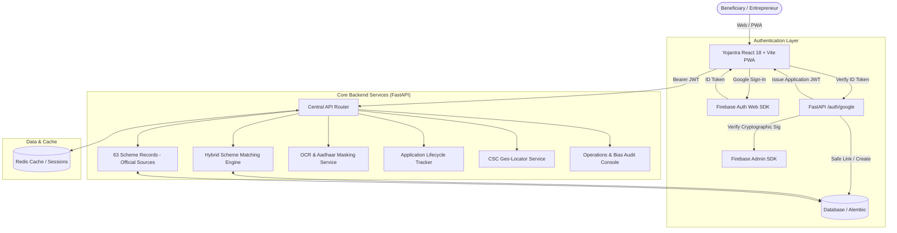

# Yojantra 🇮🇳
**Your intelligent path to government schemes.**  
*Find the government schemes made for you.*

[](https://fastapi.tiangolo.com)
[](https://react.dev)
[](https://firebase.google.com)
[](https://www.postgresql.org)
[](https://web.dev/progressive-web-apps/)

---

## 1. Executive Overview

**Yojantra** is a high-reliability, accessible, GovTech scheme discovery and application assistance platform designed specifically for micro-entrepreneurs, women founders, SC/ST, OBC, minority, rural, and youth innovators in India.

Yojantra bridges the information asymmetry between central/state government incentives and grassroots entrepreneurs by pairing **deterministic rule-based eligibility evaluation** with **explainable AI recommendations**, **document privacy (Aadhaar masking)**, **offline-first PWA architecture**, and **assisted CSC locator workflows**.

---

## 2. Core Architecture



---

## 3. Key Capabilities

### A. Google-Only Authentication & RBAC Guard
* **Google Authentication**: Native integration using Firebase Authentication Web SDK (`signInWithPopup`). Google-only authentication provides robust fraud resistance and identity assurance.
* **Backend Token Verification**: The FastAPI backend verifies the cryptographic signature of the Firebase ID token using the official `firebase-admin` Python SDK. Unverified browser payloads are never trusted.
* **Strict Role-Based Access Control (RBAC)**: New Google logins unconditionally default to the beneficiary role (`role="user"`). Administrative and partner roles (`admin`, `super_admin`, `partner_officer`, `nodal_officer`) are strictly server-managed and can never be claimed or escalated from the client.
* **IDOR Protection**: Strict resource ownership checks ensure beneficiaries can only access, view, or modify their own applications and uploaded documents.
* **Graceful Degradation**: If Firebase credentials are not yet configured on the server, the application boots cleanly and returns structured configuration guidance responses without crashing.

### B. Explainable AI Scheme Matching Engine
Yojantra separates **Hard Legal Eligibility** from **Recommendation Score (0–100)**:
1. **Canonical Eligibility Statuses**:
   * `Eligible` — Meets all statutory age, social category, turnover, and geographic rules.
   * `Possibly Eligible` — Key criteria met, but discretionary or state quotas apply.
   * `Needs Verification` — Requires physical verification of certificates (e.g., UDYAM, Caste, Land).
   * `Not Eligible` — Disqualified by statutory constraints (e.g., turnover ceiling exceeded, outside target sector).
2. **Transparent Explainability Outputs**:
   * `why_you_match`: Structured factors that contributed to the match score.
   * `missing_requirements`: Exact documentation or registration prerequisites pending.
   * `potential_issues`: Commercial constraints (e.g., mandatory collateral, offline-only DIC submission).
   * `next_action`: Clear guidance on how and where to proceed.
3. **Important Disclaimer**: Yojantra explicitly indicates that recommendation scores and rule simulations do not constitute legal government sanction or guarantee scheme disbursal.

### C. 63 Government Scheme Records Based on Official Sources
The platform database is pre-seeded with 63 government scheme records based on official central and state government sources (.gov.in, .nic.in, and official nodal guidelines) covering all mandated entrepreneur categories:
* **Women Entrepreneurs**: Stand-Up India, Stree Shakti Package, Dena Shakti, Mudra Tarun, TREAD Scheme, Mahila Coir Yojana, Annapurna Scheme, Bharatiya Mahila Bank Business Loan.
* **SC / ST Entrepreneurs**: National SC-ST Hub (NSSH), Credit Enhancement Guarantee Scheme for SCs (CEGSSC), Stand-Up India (SC/ST category), DICCI Micro-credit initiatives.
* **OBC & Minority Founders**: NMDFC Term Loan, NBCFDC New Swarnima Scheme, Maulana Azad National Fellowship, PM-VIKAS.
* **Youth & Startups**: PMEGP (Prime Minister Employment Generation Programme), Startup India Seed Fund Scheme (SISFS), Credit Guarantee Scheme for Startups (CGSS), PMKVY 4.0 Entrepreneurship, PM YUVA.
* **MSME, Manufacturing & Services**: PM Mudra Yojana (Shishu/Kishore/Tarun), CGTMSE Collateral-Free Loans, MSME Champions (ZED Certification Subsidy), CLCSS, RAMPO Scheme, Emergency Credit Line (ECLGS).
* **Agriculture, Food Processing & Rural Units**: PMFME (Food Processing), Agriculture Infrastructure Fund (AIF), PM Matsya Sampada Yojana (PMMSY), Animal Husbandry Infrastructure Fund (AHIDF), National Beekeeping & Honey Mission (NBHM).
* **Artisans & Handicrafts**: PM Vishwakarma Kaushal Samman, Ambedkar Hastshilp Vikas Yojana (AHVY), National Handloom Development Programme (NHDP).

Every scheme record contains the issuing ministry/department, target demographics, eligibility rules, benefit ceilings, interest rates/loan limits where available, required documents, application mode (Online/Offline), and verified official government portal URLs (`.gov.in`, `.nic.in`).

### D. Document Privacy & OCR Processing
* **MIME Validation & Size Guard**: Uploads are restricted to verified image/PDF types with a strict 5MB cap.
* **Aadhaar Protection**: Automated pattern recognition and masking (`XXXX-XXXX-1234`). Raw Aadhaar numbers are never logged or stored in plaintext.
* **Optical Character Recognition**: Tesseract OCR extracts document metadata for automatic onboarding verification.

### E. Application Tracking & CSC Assistance
* **Lifecycle States**: `Draft` → `Ready` → `Submitted` → `Under Review` → `Approved` → `Rejected` → `Completed`.
* **Government Portal Hand-off**: Provides direct verified URLs to official government application portals (`udyamregistration.gov.in`, `pmegp.gov.in`, `standupmitra.in`, etc.). Yojantra does not falsely claim internal submission to external government servers.
* **Common Service Center (CSC) Locator**: Haversine distance-based search helps rural beneficiaries locate nearby physical VLE kiosks for assisted application submission.

### F. Operations Console & Algorithmic Bias Audit
* **Admin Dashboard**: Real-time beneficiary counts, scheme application rates, and demographic breakdowns.
* **Bias Audit Service**: Monitors rejection and eligibility distributions across gender, caste, and state cohorts to ensure fair algorithmic scoring.

---

## 4. Feature Status Matrix

| Capability | Status | Notes |
|:---|:---:|:---|
| **Yojantra Visual Identity & Branding** | ✅ **Implemented** | Complete migration across metadata, UI, PWA manifest, and offline store. |
| **Google Sign-In (Firebase Web SDK)** | ✅ **Implemented** | Pop-up flow with user-friendly loading and error states. Google-only authentication. |
| **Firebase Admin Token Verification** | ✅ **Implemented** | Cryptographic verification via official Python Admin SDK. Unverified client tokens rejected. |
| **RBAC & Privilege Escalation Guards** | ✅ **Implemented** | Multi-tier role checks (`super_admin`, `admin`, `partner_officer`, `nodal_officer`, `user`) strictly enforced against DB records. |
| **IDOR & Data Isolation Protections** | ✅ **Implemented** | Application lifecycle and document repositories guarded by verified ownership checks. |
| **Rate Limiting & DoS Protection** | ✅ **Implemented** | Redis sliding window rate limiter with in-memory thread-safe fallback on auth, chat, uploads, and webhooks. |
| **File Security & Path Traversal Guard**| ✅ **Implemented** | MIME cross-validation, extension whitelisting (.pdf, .jpg, .jpeg, .png), and canonical boundary enforcement. |
| **Webhook HMAC & Replay Defense** | ✅ **Implemented** | HMAC-SHA256 signature verification (`X-Signature`), 300s timestamp freshness (`X-Timestamp`), and idempotency tracking. |
| **Database Migrations (Alembic)** | ✅ **Implemented** | Alembic migration `7a8b9c0d1e2f` applied cleanly without data loss. |
| **Scheme Catalog (Official Sources)** | ✅ **Implemented** | 63 Government Scheme Records based on official central/state ministries and `.gov.in` sources. |
| **Explainable AI Matching Engine** | ✅ **Implemented** | Returns 4 canonical statuses, score, why you match, and next action. |
| **Aadhaar Identity Validation** | ✅ **Implemented** | Format Validation + Masking (DPDP Act 2023 compliant last-4-digit validation). |
| **PAN Verification** | ✅ **Implemented** | Format Validation (structural checksum & entity character categorization). |
| **UDYAM MSME Registration** | ✅ **Implemented** | Format/Structure Validation (Ministry of MSME state code and nomenclature). |
| **DigiLocker Integration** | 🛠️ **Framework Ready** | Integration Framework / Sandbox Ready (OAuth2 redirect flow implemented). |
| **Government Nodal APIs** | 🛠️ **Framework Ready** | Integration Framework (curated open nodal gazette and scheme data sync). |
| **Channel Partner Routing & Fund Safeguards** | ✅ **Implemented** | Scheme-compatible partner routing across SCAs, PSBs, RRBs, NBFC-MFIs with Haversine GPS ranking & configured fund availability metadata. NPA/fund-utilization safeguards are framework-ready; live sync requires authorized banking data. |

---

## 5. Local Development & Setup

### Prerequisites
* Python 3.11+
* Node.js 18+ and npm
* PostgreSQL (Optional for local dev; SQLite fallback supported)
* Tesseract OCR (Optional; mock text extraction active if binary missing)

### Backend Setup
```bash
# 1. Navigate to backend
cd backend

# 2. Create virtual environment and activate
python -m venv .venv
# On Windows:
.venv\Scripts\activate
# On Linux/macOS:
source .venv/bin/activate

# 3. Install dependencies
pip install -r requirements.txt

# 4. Configure environment
cp .env.example .env
# Edit .env with your configuration settings

# 5. Run database migrations
alembic upgrade head

# 6. Seed schemes and CSC centers
python scripts/seed_all.py

# 7. Start FastAPI server
uvicorn app.main:app --host 127.0.0.1 --port 8001 --reload
```

### Frontend Setup
```bash
# 1. Navigate to frontend
cd frontend

# 2. Install dependencies
npm install

# 3. Configure environment
cp .env.example .env
# Edit .env:
# VITE_API_URL=http://127.0.0.1:8001
# VITE_FIREBASE_API_KEY=your_firebase_web_key
# ... other Firebase client keys

# 4. Start Vite development server
npm run dev
# App will be accessible at http://localhost:5173
```

---

## 6. Environment Variables Reference

### Frontend (`frontend/.env`)
| Variable | Description | Example |
|:---|:---|:---|
| `VITE_API_URL` | Central backend API endpoint | `http://127.0.0.1:8001` (Dev) / `https://api.yojantra.in` (Prod) |
| `VITE_FIREBASE_API_KEY` | Firebase Web Client API Key | `AIzaSy...` |
| `VITE_FIREBASE_AUTH_DOMAIN` | Firebase Web Auth Domain | `yojantra-app.firebaseapp.com` |
| `VITE_FIREBASE_PROJECT_ID` | Firebase Project ID | `yojantra-app` |
| `VITE_FIREBASE_STORAGE_BUCKET`| Firebase Storage Bucket | `yojantra-app.appspot.com` |
| `VITE_FIREBASE_MESSAGING_SENDER_ID` | Firebase Cloud Messaging Sender ID | `123456789012` |
| `VITE_FIREBASE_APP_ID` | Firebase Web App ID | `1:123456789012:web:...` |

### Backend (`backend/.env`)
| Variable | Required | Description |
|:---|:---:|:---|
| `ENVIRONMENT` | Yes | `development` or `production` |
| `SECRET_KEY` | Yes | Min 32-character string for JWT signing |
| `DATABASE_URL` | Yes | PostgreSQL connection string (or SQLite for dev) |
| `CORS_ORIGINS` | Yes | Allowed origins (e.g., `http://localhost:5173,https://yojantra.in`) |
| `FIREBASE_PROJECT_ID` | Optional | Firebase Project ID for Admin verification |
| `FIREBASE_CLIENT_EMAIL` | Optional | Firebase Service Account Client Email |
| `FIREBASE_PRIVATE_KEY` | Optional | Firebase Service Account Private Key (handles `\n` escaping) |
| `FIREBASE_CREDENTIALS_PATH` | Optional | Alternative path to service account JSON file |
| `OPENAI_API_KEY` | Optional | Enables live LLM conversational assistant |
| `TWILIO_ACCOUNT_SID` | Optional | Production SMS OTP dispatch |

---

## 7. Verification & Automated Testing

All features are covered by comprehensive automated tests:

```bash
# Run backend tests
cd backend
python -m pytest

# Run backend syntax & bytecode compilation check
python -m compileall app scripts tests

# Run frontend production build
cd ../frontend
npm run build
```

**Test Suite Status**:
* **211 Unit, Integration, Regression & End-to-End Tests**: 100% Passed (`pytest -q tests`).
* **0 Syntax Errors**: Verified across all backend modules (`compileall`).
* **0 Frontend Build Errors**: Verified through Vite production bundling (`npm run build`).
* **Docker Port Mapping**: PostgreSQL mapped to host port `5433:5432` to avoid host conflicts, with internal container connection `db:5432`.

---

## 8. Deployment Guide

### Frontend Deployment (Vercel / Cloudflare Pages)
1. Link your Git repository to Vercel.
2. Set Root Directory to `frontend`.
3. Set Build Command to `npm run build` and Output Directory to `dist`.
4. Add environment variables:
   * `VITE_API_URL=https://your-backend-domain.com`
   * `VITE_FIREBASE_API_KEY=...`
   * `VITE_FIREBASE_AUTH_DOMAIN=...`
   * `VITE_FIREBASE_PROJECT_ID=...`
   * `VITE_FIREBASE_STORAGE_BUCKET=...`
   * `VITE_FIREBASE_MESSAGING_SENDER_ID=...`
   * `VITE_FIREBASE_APP_ID=...`

### Backend Deployment (Render / AWS ECS / DigitalOcean)
1. Deploy via Docker using `backend/Dockerfile` or native Python runtime.
2. Set `ENVIRONMENT=production` and provide a secure `SECRET_KEY` (32+ chars).
3. Connect managed PostgreSQL database and run `alembic upgrade head`.
4. Configure Firebase Admin environment variables (`FIREBASE_PROJECT_ID`, `FIREBASE_CLIENT_EMAIL`, `FIREBASE_PRIVATE_KEY`).
5. Configure `CORS_ORIGINS` to match your production frontend domain (e.g., `https://yojantra.in`).

---

## 9. Security & Production Hardening

* **DPDP Act 2023 Principles**: Purpose limitation, data minimization, and automated Aadhaar masking (`XXXX-XXXX-1234`). Raw Aadhaar numbers are never logged or stored in plaintext.
* **Google-Only Authentication & Token Integrity**: Client identity is exclusively established via Firebase Google Sign-In and cryptographically validated via official `firebase-admin` Python SDK. Unverified browser claims are unconditionally rejected.
* **RBAC & Privilege Escalation Defenses**: Strict hierarchy (`user`, `partner_officer`, `nodal_officer`, `admin`, `super_admin`) verified directly against database records. Profile updates (`PUT /users/me`) explicitly filter out administrative fields (`role`, `is_active`, `is_superuser`).
* **IDOR (Insecure Direct Object Reference) Protection**: Application tracking and document retrieval endpoints strictly enforce resource ownership via `check_resource_ownership`. Beneficiaries cannot access or modify each other's records.
* **File Upload & Download Defense**: Strict extension whitelisting (`.pdf`, `.jpg`, `.jpeg`, `.png`), magic byte/MIME cross-validation, filename sanitization, canonical boundary enforcement preventing path traversal (`../`), and secure file downloads with `X-Content-Type-Options: nosniff`.
* **Webhook HMAC & Replay Defense**: External integration webhooks (CBS, PFMS) require HMAC-SHA256 signature verification (`X-Signature`), reject payloads older than 300 seconds (`X-Timestamp`), and enforce idempotency.
* **Rate Limiting & DoS Protection**: Redis-backed sliding window rate limiting with a thread-safe in-memory fallback protecting `/auth/google` (20/min), `/chat/message` (30/min), `/documents/upload` (20/min), and `/integrations/webhooks/*` (120/min). Exceeded thresholds return HTTP 429 with standard `Retry-After` headers.
* **HTTP Security Headers & Information Leakage Prevention**: Production responses include `Strict-Transport-Security`, `X-Content-Type-Options: nosniff`, `X-Frame-Options: DENY`, `Referrer-Policy: strict-origin-when-cross-origin`, `Permissions-Policy`, and strict `Content-Security-Policy`. In production (`DEBUG=False`), unhandled exceptions suppress internal stack traces and return sanitized messages.
* **Production Guardrails**: In production mode (`ENVIRONMENT=production`), the application halts boot if `DEBUG=True`, weak default secret keys, or default database credentials are detected.

---

*Built with dedication for India's micro-entrepreneurs and grassroots innovators.* 🇮🇳
